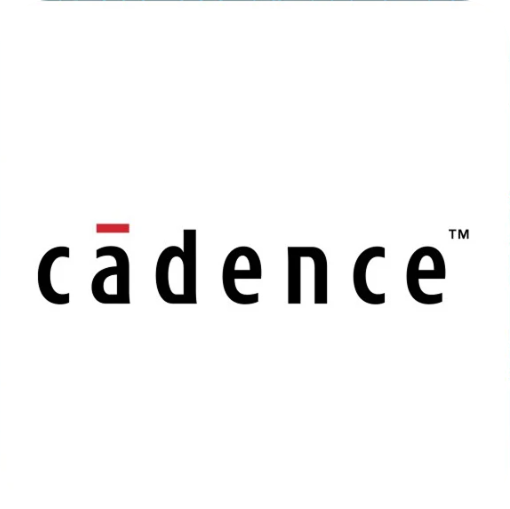
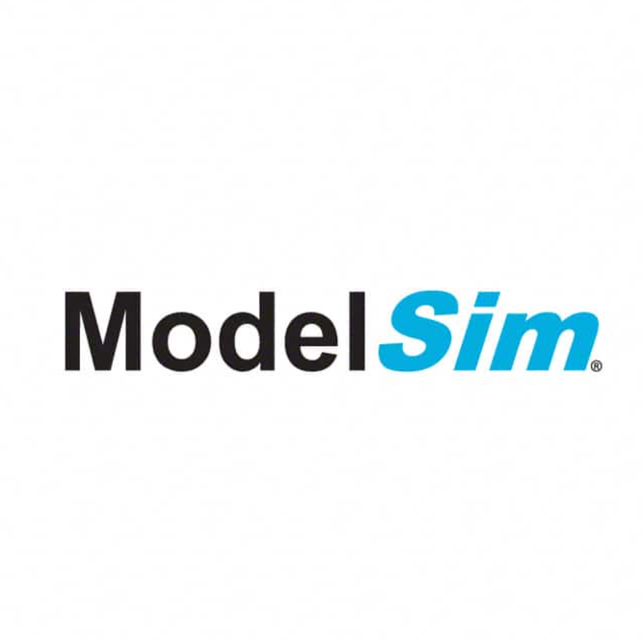
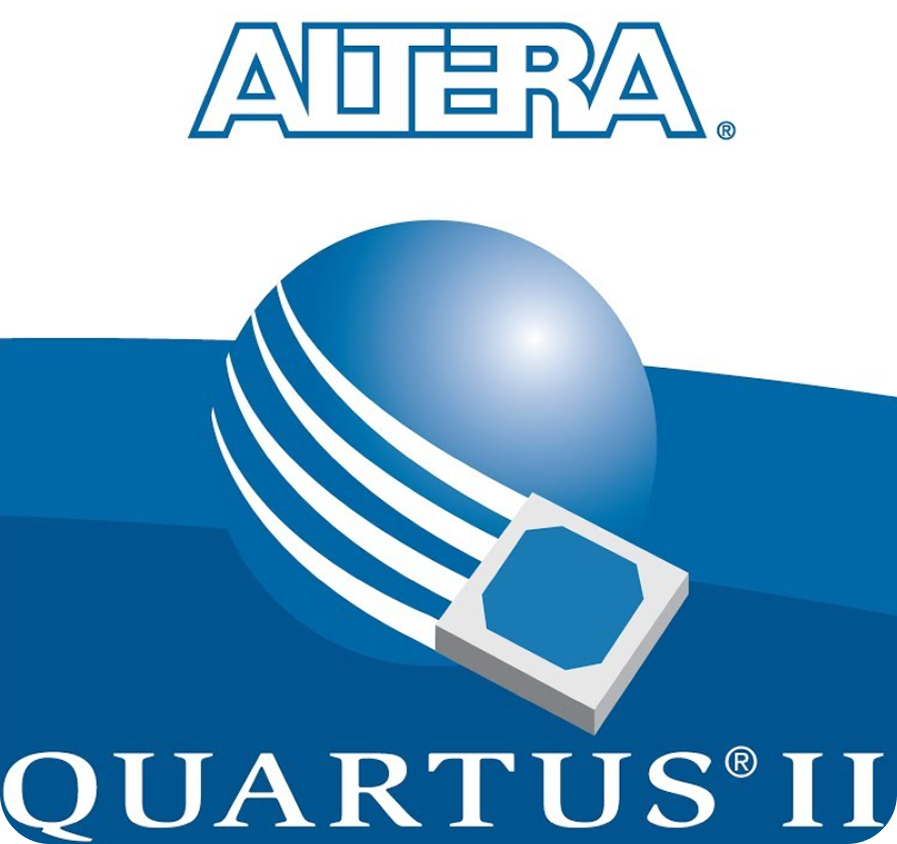
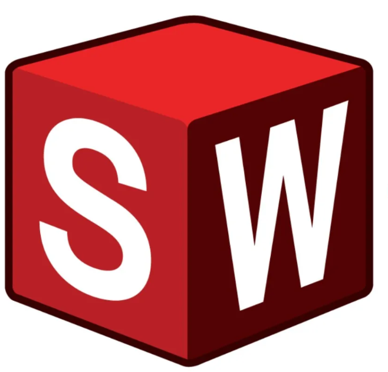

Hello 🌎, I'm Alex Niejadlik

With over 4 years of experience in hardware design and electronics, I'm on a mission to turn complex ideas into tangible, real-world devices! My background spans schematic capture, multi-layer PCB layout, and physical prototyping, bringing reliable hardware products to life for both agile startups and industry leaders. I'm dedicated to designing for manufacturability (DFM), signal integrity, and user ergonomics, thriving in fast-moving teams focused on innovation and continuous learning. Let's bring great hardware to life! 🛠️🚀

- 🔭 I’m currently working on an Ai Powered Lazar Bug Zapper
- 🌱 I’m currently learning Analog/Digital Electronics, Ai Vision, Machine Learning, HTML, CSS, and Docker 
- 💬 Ask me about Robtics, AI, Old Electronics, and Youtube
- ⚡ Fun fact: For about 10 minutes I was an all American Hurdler

### Languages and Tools:

<table>
  <tbody>
    <tr>
      <td align="left">Languages:</td>
      <td align="left">
        
      </td>
    </tr>
<tr>
      <td align="left">Hardware:</td>
      <td align="left">
        
        &nbsp;
        
        &nbsp;
        
        &nbsp;
        
        &nbsp;
        
        &nbsp;
        
      </td>
    </tr>
    <tr>
      <td align="left">Database:</td>
      <td align="left">
        
      </td>
    </tr>
    <tr>
      <td align="left">DevOps:</td>
      <td align="left">
        
      </td>
    </tr>
    <tr>
      <td align="left">Version Control:</td>
      <td align="left">
        
      </td>
    </tr>
    <tr>
      <td align="left">IDE:</td>
      <td align="left">
        
      </td>
    </tr>
    <tr>
      <td align="left">Operating Systems:</td>
      <td align="left">
        
      </td>
    </tr>
  </tbody>
</table>
